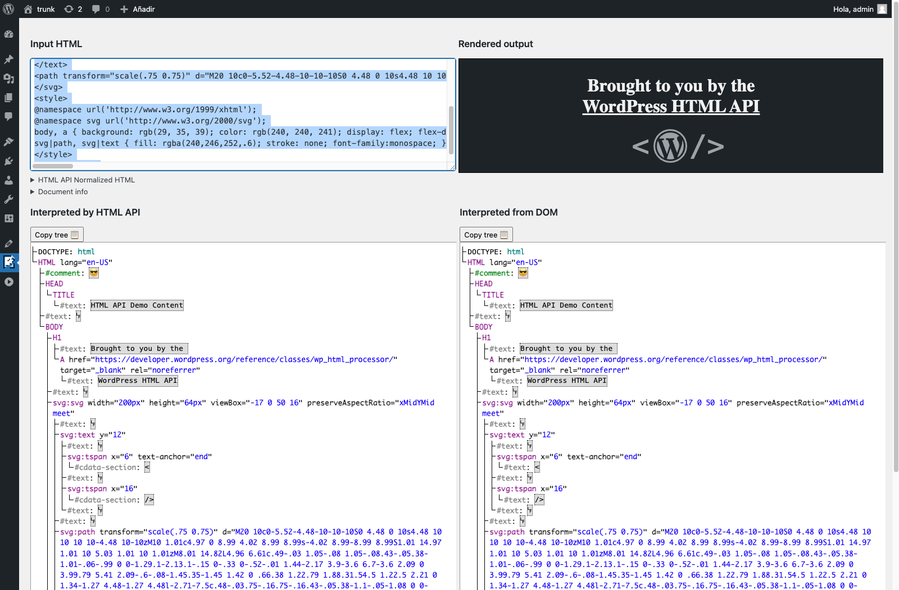

# HTML API Debugger

[This is a WordPress plugin to help debug the behavior of the HTML API.](https://wordpress.org/plugins/html-api-debugger/)

[Try it out in the WordPress Playground.](https://playground.wordpress.net/?blueprint-url=https%3A%2F%2Fraw.githubusercontent.com%2Fsirreal%2Fhtml-api-debugger%2Fmain%2Fassets%2Fblueprints%2Fblueprint.json)

